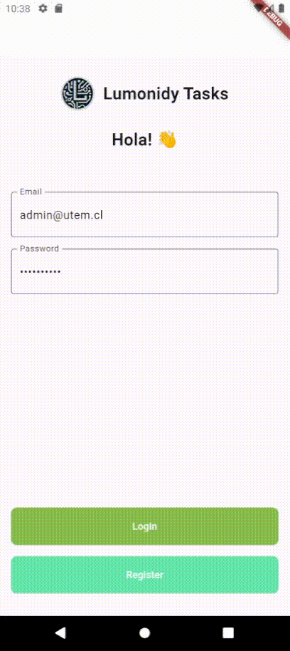
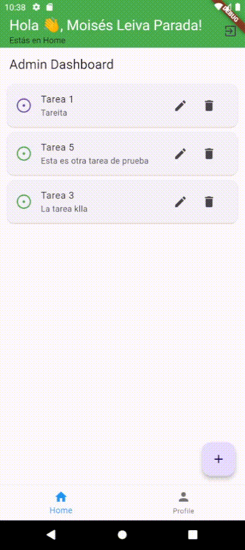
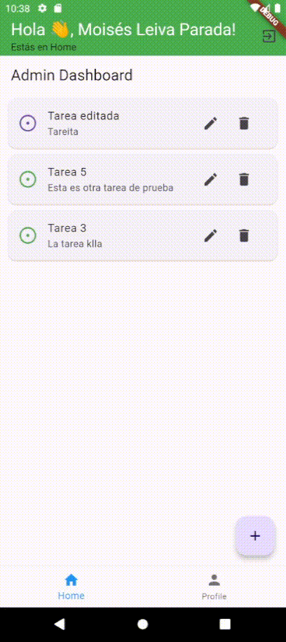
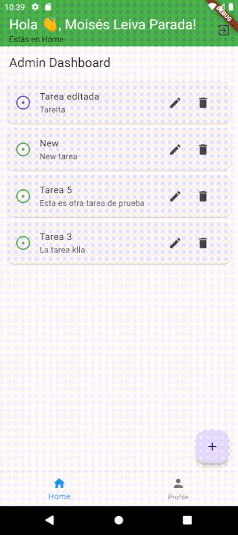
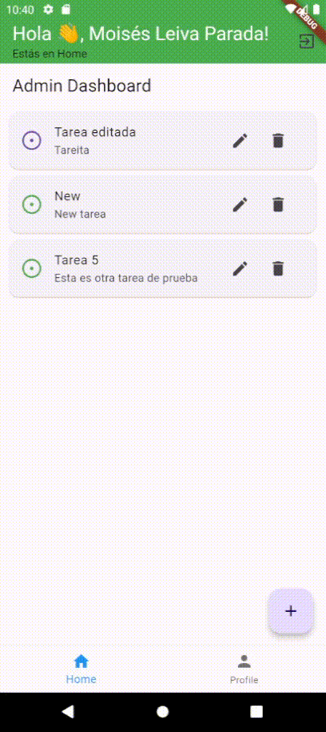

# Lumonidy Tasks

Lumonidy Tasks es una aplicación móvil diseñada para organizar proyectos utilizando una metodología similar a Scrum. El objetivo principal es proporcionar distintas vistas y gráficos que permitan gestionar tareas de forma eficiente.

## Integrantes:
El equipo actualmente se compone por: 
- Moisés Leiva Leiva [mleiva@utem.cl](mleiva@utem.cl)
- Nicolás Méndez Urzúa [nmendez@utem.cl](nmendez@utem.cl)
<h2>Diseño y Prototipos</h2>
<p><strong>Figma:</strong> Actualmente no tenemos un Figma como tal, está en desarrollo. <em>(se subirán actualizaciones apenas se pueda)</em> Pero sí que tenemos vistas de la App del desarrollo actual:</p>

<div style="display: flex; flex-wrap: wrap; justify-content: space-between;">

  <div style="flex-basis: 30%; margin-bottom: 20px;">
    <h3>Inicio de Sesión</h3>
    
    <p>Animación del proceso de inicio de sesión con autenticación de Google.</p>
  </div>

  <div style="flex-basis: 30%; margin-bottom: 20px;">
    <h3>Tap Tarea</h3>
    
    <p>Interacción con una tarea en la aplicación, destacando la función de tocar para ver detalles o interactuar con ella.</p>
  </div>

  <div style="flex-basis: 30%; margin-bottom: 20px;">
    <h3>Tap Foto</h3>
    
    <p>Funcionalidad de tocar para ver detalles de una foto en la aplicación.</p>
  </div>

  <div style="flex-basis: 30%; margin-bottom: 20px;">
    <h3>Crear Tarea</h3>
    
    <p>Proceso de creación de una nueva tarea en la aplicación.</p>
  </div>

  <div style="flex-basis: 30%; margin-bottom: 20px;">
    <h3>Eliminar Tarea</h3>
    
    <p>Interacción para eliminar una tarea en la aplicación.</p>
  </div>

  <div style="flex-basis: 30%; margin-bottom: 20px;">
    <h3>Logout e Inicio de Sesión</h3>
    
    <p>Animación que muestra el proceso de cerrar sesión e iniciar sesión en la aplicación.</p>
  </div>

</div>

## Características Principales

- **Servicio de Autenticación:** Integración con Google Firebase Auth para permitir autenticación segura mediante cuentas de Google.
  
- **Almacenamiento de Imágenes:** Uso de Google Firebase Storage para la carga y almacenamiento de imágenes de perfil de usuario.

- **Base de Datos NoSQL:** Google Firebase Firestore se utiliza como base de datos NoSQL para almacenar y gestionar datos en tiempo real de manera eficiente.

- **Visión Serverless:** El proyecto se implementa como una aplicación cliente que interactúa directamente con los servicios de Firebase, eliminando la necesidad de un servidor backend intermedio.

## Funcionalidades Actuales

Por el momento, Lumonidy Tasks ofrece las siguientes funcionalidades:

- **Autenticación de Usuarios:** Permite a los usuarios autenticarse utilizando sus cuentas de Google.
  
- **Gestión de Tareas:** Permite crear, actualizar y eliminar tareas dentro de un proyecto utilizando Firebase Firestore como backend.

- **Subida de Imágenes:** Los usuarios pueden cargar y actualizar sus imágenes de perfil utilizando Firebase Storage.

## Tecnologías Utilizadas

- **Flutter:** El proyecto está desarrollado utilizando el framework Flutter de Google para la construcción de aplicaciones móviles nativas.

- **Dart:** El lenguaje de programación utilizado para desarrollar la lógica del proyecto, compatible con Flutter.

- **Google Firebase:** Se utiliza la suite de servicios de Firebase (Auth, Firestore, Storage) para proporcionar funcionalidades de backend a la aplicación móvil.

## Configuración del Proyecto

Para ejecutar este proyecto en tu entorno local, sigue estos pasos:

1. **Clonar el Repositorio:**
   ```bash
   git clone https://github.com/moisesnks/lumonidy_tasks
   ```

2. **Instalar Dependencias:**
   ```bash
   cd lumonidy_tasks
   flutter pub get
   ```

3. **Configurar Firebase:**
   - Crea un proyecto en [Firebase Console](https://console.firebase.google.com/).
   - Agrega tu aplicación Flutter al proyecto Firebase.
   - Instalar el [CLI de Flutter Firebase](https://firebase.flutter.dev/docs/cli/), para hacer la configuración del proyecto de manera más simple y sencilla.

4. **Ejecutar la Aplicación:**
   ```bash
   flutter run
   ```

## Contribuciones

Las contribuciones son bienvenidas. Si deseas contribuir a este proyecto, sigue estos pasos:

1. Realiza un fork del repositorio.
2. Crea una nueva rama (`git checkout -b feature/mejora`).
3. Realiza tus cambios y confirma (`git commit -am 'Añade una mejora'`).
4. Sube tus cambios a la rama (`git push origin feature/mejora`).
5. Abre una solicitud de extracción en GitHub.

## Contacto

Para más información sobre este proyecto, contáctame en [mleiva@utem.cl](mailto:mleiva@utem.cl).
